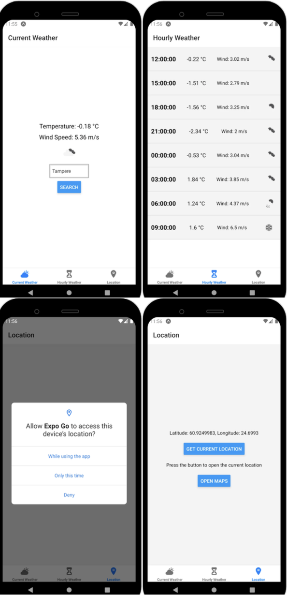
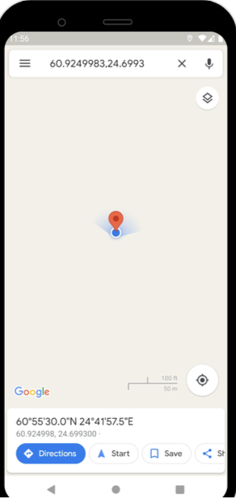
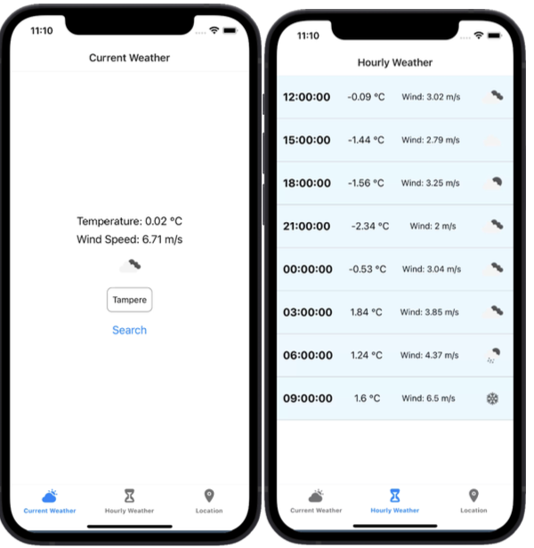
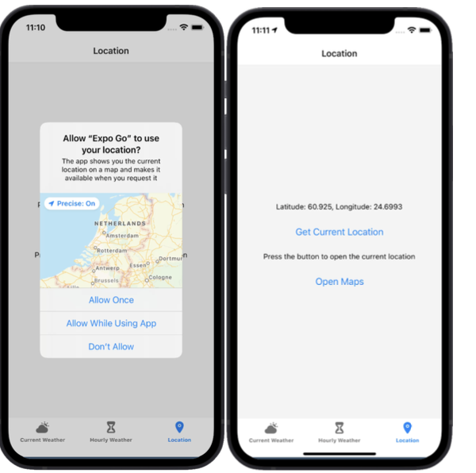
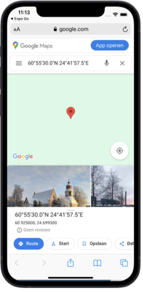

# React Native Weather Application

## Description
This project is a mobile weather application built using **React Native**. The app provides users with real-time weather information, an hourly forecast, and location details. It features a tab-based navigation system with three tabs: **Current Weather**, **Hourly Weather**, and **Location**.

---

## Key Features

### 1. **Current Weather Screen**
- Displays information about the current weather conditions.
- Shows an icon (e.g., sun or cloud) to visually represent the weather status.
- Includes key details such as:
  - Temperature
  - Wind speed

### 2. **Hourly Weather Screen**
- Provides an hourly forecast for the upcoming hours.
- Displays temperature and weather details for each hour.
- Allows users to track how the weather is expected to change throughout the day.

### 3. **Location Screen (LocationApp)**
- Integrates location-related functionality using the device's GPS.
- Retrieves the user's current latitude and longitude.
- Includes a button that opens the device's map application, centered on the user's current location.

---

## Technologies Used
- **React Native**: For cross-platform mobile application development.
- **GPS Integration**: To fetch the user's current location.
- **Tab-Based Navigation**: For an intuitive user experience across multiple screens.

---

## Screenshots

### 1. Android

### 2. IOS

---

Feel free to extend this app with additional features, such as weekly weather forecasts or weather alerts!
